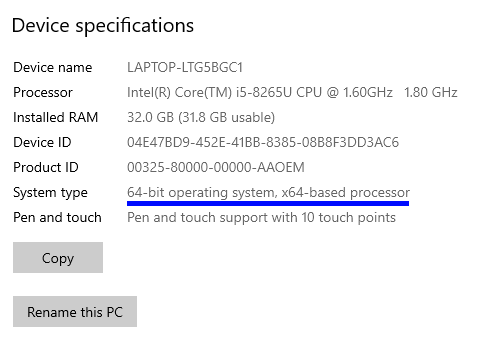
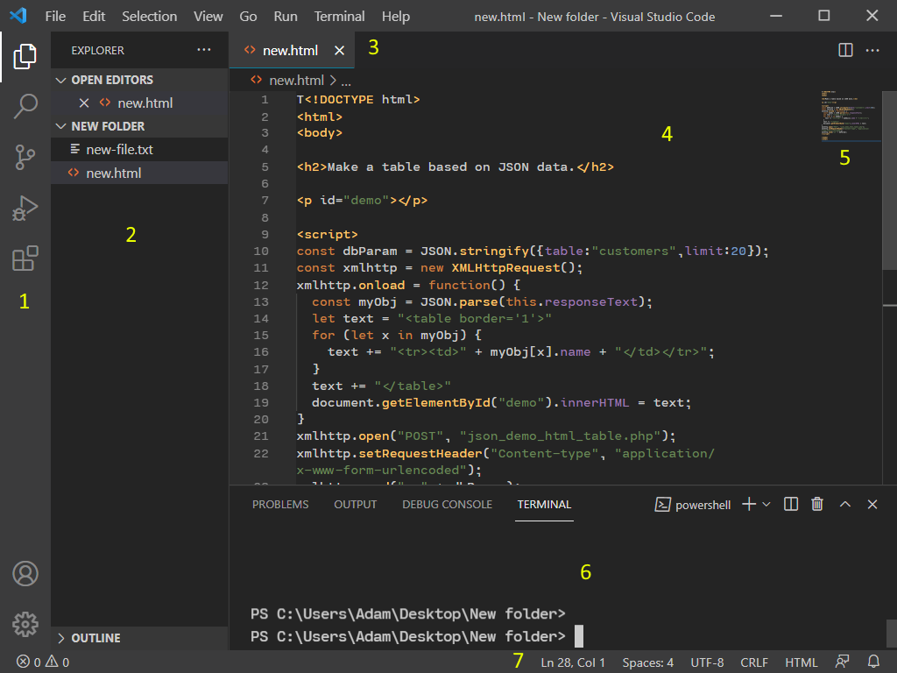
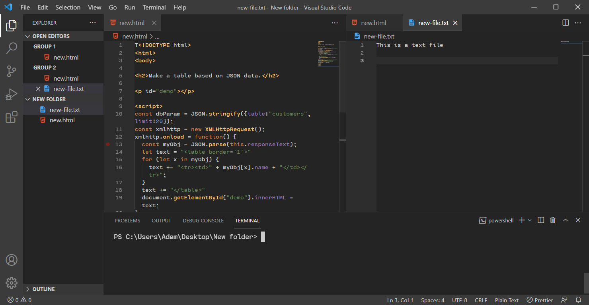
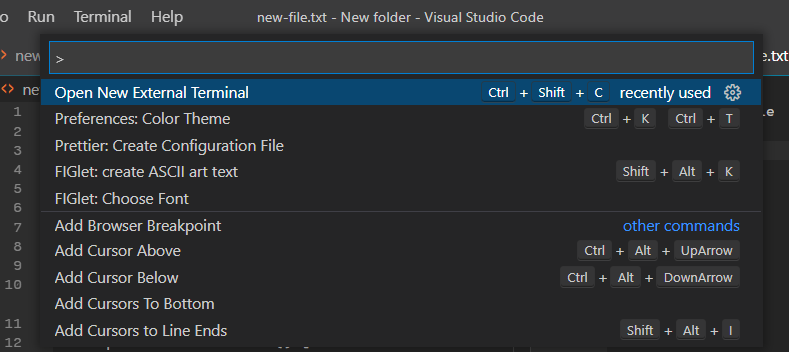
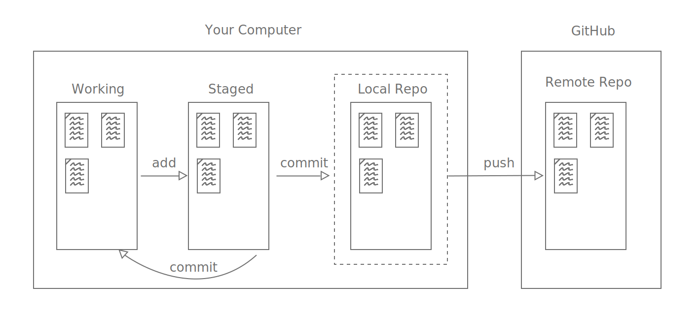
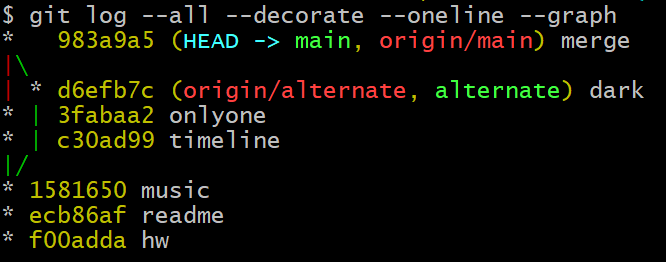
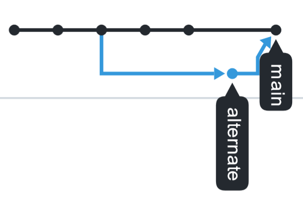

# Lab 1: Visual Studio Code, Git and Github

ENSE 374 - Software Engineering Management - Laboratory

University of Regina - Engineering and Applied Science - Software Systems Engineering

Lab Instructor: [Adam Tilson](mailto:Adam.Tilson@uregina.ca)

---

## Objective

This lab introduces some of the tools used in this course, including a modern code editor, Visual Studio Code, version control with Git, and remote repository hosting with GitHub. It will also discuss how to make your projects on GitHub stand out, with good documentation, code presentation and pages; and how to use your GitHub account as a development portfolio. 

## Equipment

Computer running Windows, MacOS or Linux, with an Intel or AMD-based processor (x86 or x86-64) with administrator privileges. 
- These proceedures have been succesfully completed on all three operating systems, but some minor differences may exist
- This lab course has also been partially tested and is likely completable on ARM Mac or ARM Linux

## Part 1: Visual Studio Code

Visual Studio Code is a lightweight code editor with many extensions. 

### IDE Vs. Editor

IDE - Integrated Development Environment
- Tend to have a larger install, slower to run, have more tools, and may be dedicated to a single language.
- Examples: Visual Studio, JetBrains, Eclipse

Code Editors - tend to be more lightweight, faster, fewer tools, universal across coding languages.
- Examples: Sublime Text, Atom, VS Code

### IDE / Editor Spectrum

Subjective, on a scale of Visual Studio to Notepad...
```
                     Eclipse                               Notepad++
Visual Studio ----------|--------------------|------|--------|---------- Notepad
                                          VS Code  Atom
```
*** Visual Studio Code is NOT Visual Studio ***

The further you progress as a developer, the more likely you gain a preference for one tool or another.

### Installation

[Download Visual Studio code here...](https://code.visualstudio.com/)

Do I have a 64 bit processor? Probably. 
In windows you can check by...
- Start -> Search -> about your PC




### Major Features

Fast, cross-platform, MIT Licensed*

_What they brag about on the website:_

- IntelliSense - syntax highlighting, auto-complete. 
    - Figures out which language you are coding in and provides "smart" solutions.
- Built in Debugging - Break points, call stacks, interactive console
- Built in Git - However, we'll stick to the command line...
- Extensions - So many good ones!
  
They took the best parts of other editors, and put the old M$ spin on it.

* binaries are not MIT as they contain telemetry, and not all MarketPlace extensions are not necessarilly FLOSS.
* If ever they Microsoft it up, there's always the FLOSS fork VS Codium.

### Layout



1. Left panel - explorer, search, extensions
2. This area changes depending on what is selected in (1).
3. Tabbed interface lets you have multiple files open at once.
4. Centre stage is where you will edit your code
5. The minimap is a zoomed out view of your code, and helps you navigate quickly.
6. Terminal, debugging and output appear down here.
7. See which modes the editor is in, like language, line endings, tab size, etc.
   
### Useful Built-in Features

- Emmet: HTML 5 autocomplete.
- Autosave (File -> Autosave)
- Multi code views (ctrl+1, ctrl+2 ... etc)



### Command Palette

` Ctrl + Shift + P`, type in what you are looking for



### Terminal

`ctrl + shift + ` ` (backtick)
- If that shortcut is cumbersome, you can always use the command palette! 
- Starts at the root of your workspace
- You can have multiple terminals at once, e.g. one running a server and one a client. This is useful if a running service 'consumes' a terminal

### Themes

- You can get them in the search bar for extensions, lately I like `Darcula`, `Horizon`, `Noctis`, and `GitHub Dark`
- Protect your eyes! Use a dark (or gentle light) theme
- [Find your theme here](https://vscodethemes.com/)

### Extensions

`Prettier` (Code formatter)

`Snippets` (Like Emmet, but for different languages)

`Material Icon Theme` (Nice bold file type icons!)

`Bracket Pair Colorizer` (To visually spot mismatched brackets)

`AI Autocomplete` (A couple different ones exist... are robots going to take your job?!)

### Where to get help

You can try [the official docs](https://code.visualstudio.com/docs/)

You can also try Google / StackOverflow
- Remember, it's unlikely you are the first person to have this problem!

## Part 2: Git

### Version Control

Git is version control software responsible for backing up different version of your source code over time, and letting you to restore or jump between different versions. Git aids in backup, branching, and collaboration. A Git Repository (repo) is the name for the database in which source files are stored.

### Time Travel

Git allows incremental versions. If you break something, you can always go back to a previous version. Whenever you have things working the way you like, you can check in your work to ensure you can always return to this point in time.

### Parallel Universes

Git allows branching. You can have multiple versions of your source existing simultaneously, e.g. different members can work on individual features in isolation, and then you can combine your work together at the end, often pain free. 

### Locations

Your code can be stored on a local repository (repo) or a remote repo. 
- The local repo is your personal copy, the remote repo is the copy everyone shares.

### Stages

Your files can exist in 4 states:

"Working", "Staging", "Local Repo" and "Remote Repo"



By default, files are in the working state.

- When you run the `add` command, a file is moved from working to staged. This means git knows to include it next time work is checked in.

- When you run a `commit` command, all of the staged files are backed up into the local repository, and the local files are returned to the working state.
    - This means, if you want to do another backup, you will need to `add` them again.
- Finally, when you wish to synchronize the local repo with the remote repo, you will use a `push` command.

### Get Git

While GUI utilities exist, in this course we'll use Command Line Interface (CLI) git. Once you get used to it, CLI tends to be much faster for repetitive tasks like this.

[This guide explains how to install Git.](https://git-scm.com/book/en/v2/Getting-Started-Installing-Git)

[If you are on windows, check out this download page.](https://git-scm.com/downloads)

### Git Bash / CLI

The Git Bash is a command line for working with Git. It's a Terminal Emulator for Unix-like systems. 

You could instead just use the one in VS Code! Or the Terminal in Mac, Linux or the Powershell in Windows.

### git config

First we set up our name and credentials
```
> git config --global user.name "Your Name"
> git config --global user.email you@yourdomain.ca
```

### git init

Navigate to a directory we want to become a repo, and run the command:

```
> git init -b main
```      

Note: This command may not be available unless you are on the newest version of git, otherwise, you can do:

```
> git init
> git checkout -b main
```

### git status

See what's happened, if anything:
```
> git status
```    

### git add

There are many ways to add...

```
> git add <list of files>
> git add --all
> git add *.txt           txt files in current directory
> git add docs/*.txt      txt files in docs directory
> git add docs/           all files in docs directory
> git add "*.txt"         txt files in whole project
```

### git commit

Commit your files with a message explaining your changes
```
> git commit -m "create initial files"
```
And files are now committed. You can check with `git status`...

### .git directory

Where are all of these changes being stored?

There is a hidden directory in the root directory, `.git`

This is your local repo - if you delete this, you lose all your commits!

You may not be able to see this depending on your Operating System settings - in Linux directories which begin with a `.` are hidden by default.

### Where to get help?

```
> git help
```

[Atlassian has a pretty good Cheat Sheet](https://www.atlassian.com/git/tutorials/atlassian-git-cheatsheet)

[Atlassian also has excellent help docs](https://www.atlassian.com/git/tutorials/setting-up-a-repository)

[And the Git docs are pretty good too](https://git-scm.com/docs)

## Part 3: GitHub

GitHub is a service for hosting remote Git repo's.

### Website

[Github](github.com) is now owned by our benevolent? overlords at Microsoft

- alternatives: GitLab, BitBucket. You can even host a repo on your own server!

### Create account

Fast, easy and free. 

Recommended: use your real name if you can - This will hopefully become one of the spokes of your professional life online

### Create remote

Repositories -> New
- Create a name, description, and you can omit the rest for now

### Link and push to remote

We've already started our Git local, so we link and need to push to it...

Your commands will be different than this, but along these lines...
```
> git remote add origin git@github.com:adamtilson/374test1.git
> git branch -M main
> git push -u origin main
```

### Check status on web

On the website, you can click on the project name and see which files have been uploaded

### Where to get help

[The official help docs.](https://docs.github.com/en)

## Part 4: Advanced Git Usage

### Time travel

We can "undo changes" and "rewrite history"

Revert from staged to working

```
> git reset cat.txt
```

See the history of the repo with

```
> git log
```

Note the commit hashes. 

Undo a commit: 

```
> git revert <commit-hash>
```

Go back in time to a previous commit

```
> git checkout <commit-hash>
```

However, this puts us in "detached head" mode, basically we are only an observer. 
- If you want to make changes, you can create a new branch from here, make changes, and then merge them in.

### Branching

To create a new branch, run...

```
> git branch <branch-name>
```

e.g. to create a branch called "cat", do 

```
> git branch cat
```

The branch is created, but we haven't switched to it. We can hop between branches with checkout, e.g. switch to cat

```
> git checkout cat
```

Switch back to main


```
git checkout main
```

Try adding, commiting, and pushing. The branch structure is maintained in the local and remote repos.

### Merging

to merge back into main, make sure you are in main, and then merge in the cat branch...

```
git checkout main
```
```
git merge cat
```

If no changes were made in the main, this is a fast forward.

### More advanced git log

As your graph grows in complexity, it can be trickier to understand. You can try this method, `git log adog`

```
git log --all --decorate --oneline --graph
```

### Merge conflicts

When trying to merge two branches, and a file exists between both which has been edited, a merge conflict will occur. 
- You will need to manually fix each of the differences. 
- If we are using VSCode, these will all be done in VS Code
- A `diff` section is added to each file which has merge conflicts which you will need to manually fix. Edit this file.
- Clear up all of the junk until you are left with what you are happy with
- Save the file, Lock it in the results with an add, commit, push
* In VSCode, there are some shortcuts at the top for common actions, eg. accept incoming, etc. 

### Walkthrough

Let's see it in action

`echo text >> new.txt`, add, commit, push, status

create "r" branch

switch to "r" branch

`echo red >> color.txt`, add, commit, push

revert to main

`echo blue >> color.txt`, add, commit, push

merge in "r" branch

In VS Code, you can just click on the top what you want to do.

### FAQ

How often should you push?
- When working on a big project, once per day is a common minimum. Once per "unit of work" is even better, assuming your work units can be completed in less than a day.

### Gitignore

Occasionally there are files we don't want to be tracked by our project. This might include files automatically generated by a particular editor, cached objects, files added by a package manager, or compiled binaries. We can explicitly ignore them by adding their filenames to another hidden file called `.gitignore`

Additionally, if you are going to be working with a particular type of project, we can download a premade gitignore file which will automatically filter unneeded file types.

### Git Pull

If others added files to the remote repo which you do not have on your local machine, you can fetch them with... 

```
git pull
```

### Cloning

`Cloning` is the process of copying an entire remote repo into a new folder on your computer, making a complete second local copy of the project. This can be useful if you wish to join an existing project.

## Part 5: High Quality Github Repos

### readme.md Markdown File

If a file named `readme.md` is uploaded to GitHub, it will be automatically displayed on the main page of the Repo
- Markdown is an easy to read and write language for formatting documents
- It's also what I make my Lab Docs in!
- You can include: text, lists, images, headers, quotes, code

[A very simple guide is here](https://guides.github.com/features/mastering-markdown/)

The bare minumum that you should have in your `readme.md` is:
- The purpose of this project
- Project dependencies, if any
- How to compile the project
    - Ideally, vefiry it compiles by pulling and building on a clean development environment

### Git wiki

[Foster a community of collaborative developers with a wiki](https://docs.github.com/en/github/building-a-strong-community/about-wikis)

### Git pages

You can host static webpages related to your project using [GitHub Pages](https://pages.github.com/)

You can even use a static site builder, like Jekyll, for making blogs which can be hosted on GitHub pages. I am also using this utility to make the lab site.

### Git portfolio

Check out your github profile, it includes things like projects you have worked on, what you have committed to, how frequently you commit, that sort of thing. You will want to showcase high quality work:

### Avoid Code Smells

One day a hiring manager may be browsing your github, looking at your code. What things do you not want to be there?
- Code smells
- Big blocks of commented out code
- No unit tests
- Bad variable names
- Lines of code that just keeps going on forever so that you wonder if the person who was writing the code even gets the concept of having line breaks or maybe their enter key is broken who knows in any case it doesn't look the greatest in your repo (and you can spot these long lines really really fast in the minimap or when scrolling!)

### Embrace Clean Code

Tim will be teaching you all about this throughout the semester. Follow the principles taught and your portfolio will be in excellent shape!

## Lab Assignment

1. Download and install Visual Studio Code.
2. Download and install Git.
3. Create an account on GitHub using your own name (or a variation as required).
4. Create a Local Repo.
5. Create a Remote Repo (ENSE 374 Lab 1) and link them.
6. Perform the following operations. 
**After each step, be sure to save, stage, commit and push.**
- In your favorite programming language, create a "Hello World" file. This is the simplest program you can create in that language which prints out the phrase "Hello World" to the screen.
- Create a second "readme.md" file. Add some Markdown code. Add at least 3 different types of elements.
- Create a "music.txt" file. Type some music you like into the file, eg. a song, artist or album. 
- Create a new branch called "alternate".
- Still in main, create a "timeline.txt" file. Add the text "best timeline".
- Create a "onlyone.txt" file. Add whatever text you would like to the file.
- Switch to the second branch.
- Ensure the "onlyone.txt" and "timeline.txt" files are not visible in this branch.
- Create a "timeline.txt" file, and add the text "darkest timeline" and save.
- Switch back to main
- merge
- fix the merge conflict however you would like
**Be sure to do a final stage, commit, push.**
1. Verify the Git network looks like this one, local and remote:


- You can find a network graph on github in `Insights -> Network`
8. Meet me in a breakout room and show me it is working! (Today before you leave, or during the next lab session.) Be prepared to answer some questions!

Have fun with VS Code, Git and Github!