# Lab 2: HTML

ENSE 374 - Software Engineering Management - Laboratory

University of Regina - Engineering and Applied Science - Software Systems Engineering

Lab Instructor: [Adam Tilson](mailto:Adam.Tilson@uregina.ca)

---

## Objective

The purpose of this lab is to briefly introduce the View component of the MVC, and particularly to introduce the Hyper-Text Markup Language (HTML). In this tutorial we will explore the building blocks of the front end of the web by discussing the different elements that make up the View, what they do and how they interact. We will then focus especially on HTML, the core building block of all websites.

## Equipment

Computer running Windows, MacOS or Linux, with an Intel or AMD-based processor (x86 or x86-64) with administrator privileges. 
- A modern web browser, with a strong preference for Firefox or Chrome
- A text editor, preferably VS Code

## Part 1: The Full Stack

Over the course of the semester we will be working with the following technologies in the lab:

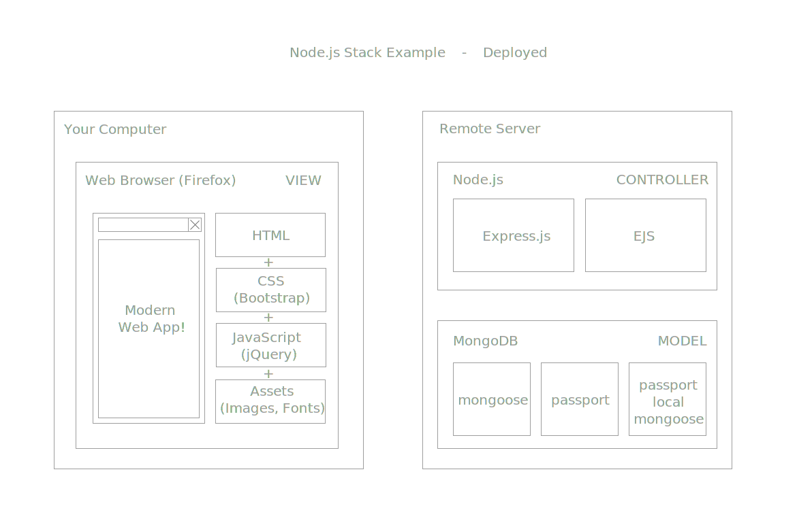

Over the next four weeks we will focus on different parts of the View. We will then look at the Controller for two weeks, and the Model for two weeks. We'll come back to this often to remind you how everything works.

Hopefully by continuing to refer to this diagram, it will be clear how the different components of the system are functioning together. (This was a point students struggled with last year.)

## Part 2: The View

In Web Development (web dev) there are three types of files used to render the front end which users see: HTML, CSS and JavaScript. Sometimes these are generated by front-end libraries, like Angular, React, Vue, or incorporate useful libraries like BootStrap or jQuery, but fundamentally these are the technologies browsers run on. Your browser requests these files, they are delivered from a server over the internet, and then rendered in the browser.

### HTML

In modern web dev, HTML is used only to specify which components will appear on the page, and define order and hierarchy (parent-child relationship, akin to a tree data-structure). If we think of front-end web dev as building a house, HTML is the blueprint and bricks. You can build a web site using only HTML, though it will probably look like a [90's geocites website](http://www.oocities.org/).

### CSS

Cascading Style Sheets (CSS) is used to style the website. This makes the elements appear where and how you want them to appear. In our analogy of building a house, CSS are the decorations. A popular library for CSS is BootStrap, which standardizes and speeds up design. We'll look at CSS in Lab 3.

### JavaScript

JavaScript is a programming language which runs in the browser, for adding animations and simple interactions with the website through the Document Object Model (DOM). For security reasons, there are limits to what can be done in JavaScript. In our house analogy, JavaScript is the electricity, it makes things work. We'll look at JavaScript in Lab 4, and a popular extension, JQuery, in lab 5.

### Single Responsibility

In Software Engineering, Single Responsibility principle is the idea that each module should only perform one task. We will broadly follow this concept in this course. In other words, HTML should only handle object instantiation, CSS should only handle styling, etc. However, we will see several way we can violate this, such as:
- styling elements through HTML tags
- adding web elements using the JavaScript through the DOM
As much as possible, we want to avoid using these components for unintended purposes! It makes code harder to read, understand and change.

## Part 3: Markup to HTML

HTML is The only required element of a website. Made up of XML-like tags which surround the content and further describe what type of content it is.

### Markup

The term markup comes from manuscript submission, where the editor would make notes describing _how_ we would like to print text. For example, underline this, emphasize this, etc.

Modern markup languages similarly employs tags to explain how we want the text to be rendered. There is a default rendering style, (which arguably pretty antiquated) and custom rendering styles we'll look at later using CSS. For now, the important take away is that we are using HTML to explain **the purpose** of the enclosed content, regardless of the visual presentation.

### Quick Example:

Let's try an example using a classic text, Bram Stoker's Dracula:

```
CHAPTER I

JONATHAN HARKER’S JOURNAL

(Kept in shorthand.)

3 May. Bistritz.—Left Munich at 8:35 P. M., on 1st May, arriving at Vienna early next morning; should have arrived at 6:46, but train was an hour late. Buda-Pesth seems a wonderful place, from the glimpse which I got of it from the train and the little I could walk through the streets. I feared to go very far from the station, as we had arrived late and would start as near the correct time as possible. The impression I had was that we were leaving the West and entering the East; the most western of splendid bridges over the Danube, which is here of noble width and depth, took us among the traditions of Turkish rule.
```

Without any context, each chunk of text looks exactly the same. 

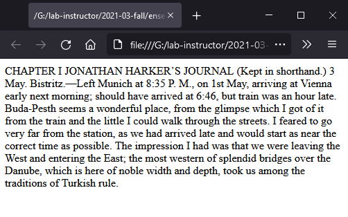

How do we differentiate one from another? Here's how Project Gutenberg renders the same text.

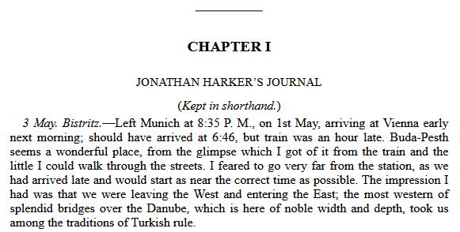

Can we do this? Let's start by pasting this into a new file in vs code...

## Main entry point: `index.html`

By default, the main file in html is called `index.html`. Let's create a new file called index.html and paste this in.

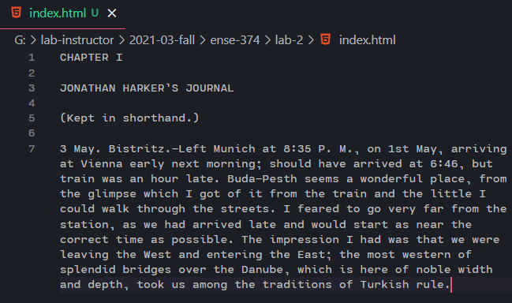

We can preview this file in a browser by double clicking the HTML...


Beautiful. Let's start annotating it. The chapter section is a title, let's embed it in a heading tag, h1.

```html
<h1>CHAPTER I</h1>

JONATHAN HARKER’S JOURNAL

(Kept in shorthand.)

3 May. Bistritz.—Left Munich at 8:35 P. M., on 1st May, arriving at Vienna early next morning; should have arrived at 6:46, but train was an hour late. Buda-Pesth seems a wonderful place, from the glimpse which I got of it from the train and the little I could walk through the streets. I feared to go very far from the station, as we had arrived late and would start as near the correct time as possible. The impression I had was that we were leaving the West and entering the East; the most western of splendid bridges over the Danube, which is here of noble width and depth, took us among the traditions of Turkish rule.
```

What does this look like:

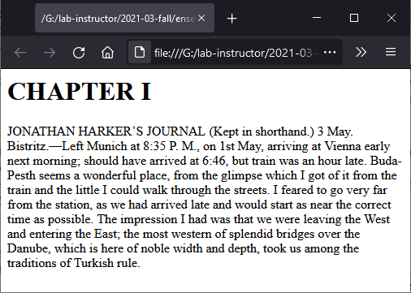

Not exactly the way that we want, but we have achieved our goal of "marking up" the text - we have successfully described that the purpose of this text is to act as a heading. While there are methods for changing the appearance in HTML, we'll leave this for CSS next week. Recall - separation of concern!

Let's add some more tags...

```html
<hr>
<h1>CHAPTER I</h1>

<h2>JONATHAN HARKER’S JOURNAL</h2>

<em>(Kept in shorthand.)</em>

<p><em>3 May. Bistritz.</em>—Left Munich at 8:35 P. M., on 1st May, arriving at Vienna early next morning; should have arrived at 6:46, but train was an hour late. Buda-Pesth seems a wonderful place, from the glimpse which I got of it from the train and the little I could walk through the streets. I feared to go very far from the station, as we had arrived late and would start as near the correct time as possible. The impression I had was that we were leaving the West and entering the East; the most western of splendid bridges over the Danube, which is here of noble width and depth, took us among the traditions of Turkish rule.</p>
```

How does the preview look now?


We added a horizontal rule (hr) lower heading (h2), the emphasis tag, and the paragraph. Note that the paragraph tag encloses the emphasis tag, an example of nested tags (hierarchy).

While our browser is rendering our file correctly, it isn't exactly compliant HTML. This is because we are missing some necessary tags.

### Boilerplate HTML

Boilerplate refers to standard, preprinted text, needed to make a language compliant. You've likely already seen the c++ boilerplate...

```c++
#include <iostream>

int main() {
    std::cout << "Hello World!";
    return 0;
}
```

We can create the boilerplate in VS Code using Emmet and the `!` key.

```html
<!DOCTYPE html>
<html lang="en">
<head>
    <meta charset="UTF-8">
    <meta http-equiv="X-UA-Compatible" content="IE=edge">
    <meta name="viewport" content="width=device-width, initial-scale=1.0">
    <title>Document</title>
</head>
<body>

</body>
</html
```

But where does our text go? It needs to go into the body. While we're at it, let's change the `<title>` tags inner HTML as well:

```html


<!DOCTYPE html>
<html lang="en">
<head>
    <meta charset="UTF-8">
    <meta http-equiv="X-UA-Compatible" content="IE=edge">
    <meta name="viewport" content="width=device-width, initial-scale=1.0">
    <title>Dracula</title>
</head>
<body>
    <hr>
    <h1>CHAPTER I</h1>

    <h2>JONATHAN HARKER’S JOURNAL</h2>

    <em>(Kept in shorthand.)</em>

    <p><em>3 May. Bistritz.</em>—Left Munich at 8:35 P. M., on 1st May, arriving at Vienna early next morning; should have arrived at 6:46, but train was an hour late. Buda-Pesth seems a wonderful place, from the glimpse which I got of it from the train and the little I could walk through the streets. I feared to go very far from the station, as we had arrived late and would start as near the correct time as possible. The impression I had was that we were leaving the West and entering the East; the most western of splendid bridges over the Danube, which is here of noble width and depth, took us among the traditions of Turkish rule.</p>
</body>
</html>
```

The preview doesn't change, but the document is now HTML5 compliant. Nice! Note that the title is now displayed in the tab at the top.

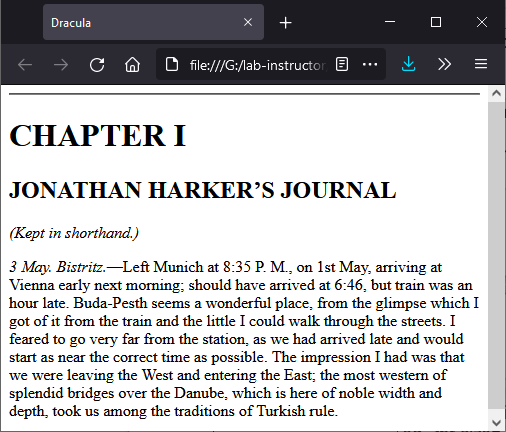

### Boilerplate HTML 5 Tags
- Some of the auto populated tags include:
- The Charset meta tag: Which character set we are using. Older character sets may not have letters for certain languages, or certain emoji.
  - UTF-8 has the best compatibility
- The Viewport meta tag: is used for mobile devices to indicate which device sizes the website was designed to run for, and is important in mobile-first design.
- The HTTP-equiv tag is used for supporting legacy Internet Explorer browsers.
- Other meta tags can be used as well. These are typically read by robots and used for things like putting the correct search term on google.

## Part 4: Tags

Let's break down how HTML is composed.

The objects in angled braces are called tags
- Many tags surround text, formatting it and/or adding functionality
  - When surrounding text, the closing tag uses the `/`, e.g. `</h1>`
- Tags can surround other tags, this forms the tree of the page. Adjacent elements are siblings, while nested elements have a parent-child relationship.
- The standard boilerplate tags make the tree:
```
html
 |--- head
 |     `--- title
 |
 `--- body
```
- We typically want this tree to expressed in our HTML source document through indentation, but this can be done automatically with Code Formatters.
- Some are self-closing, which mean they don't surround text, e.g.`<hr>`
- Some tags require attributes to give them further functionality

### Position, Block and Inline

Nearly everything about how HTML elements can be displayed can be overwritten with CSS, which we will look at next week, however for now there are a few important concepts to help understand how elements will be displayed:

`Block` elements will always start on a new line, and take up the full width
`Inline` elements will be placed adjacent to existing elements

We've already seen this - the headers were blocking elements, while the emphasis tags were inline.

[W3Schools on Block and Inline](https://www.w3schools.com/html/html_blocks.asp)

### Attributes

If a tag is like a function, attributes are like the arguments to that function. They have names and values. For example, we looked at the horizontal rule. We can make it wider with:

```html
<hr size="3">
```

However, this violates one of our rules (separation of concern), since we are attempting to apply style using HTML. It is better to do this through CSS, so this approach is not advised, thus many attributes are deprecated, though some are still required.

### Where can learn about tags?
- [Mozilla Developer Network](https://developer.mozilla.org/en-US/docs/Web/HTML)
- [W3Schools](https://www.w3schools.com/tags/default.asp)
- [devdocs.io HTML](https://devdocs.io/html/)

### Common Tags and their Usage

| tag | usage |
| --- | --- |
|`<h1>text</h1> to <h6>text</h6>`| Headings, in descending order of importance|
|`<hr>`| horizontal rule (Self-closing)|
|`<br>`| Break (self-closing) |
|`<p>text</p>`|paragraph tag|
|`<em>text</em>`| conveys this is important -> (usually) renders as italicized|
|`<strong>text</strong>`| even more important -> renders as bold|
|`<ul>`<br>`<li>list text</li>`<br>`</ul>`| unordered (bulleted) list, with list elements (children)|
|`<ol>`<br>`<li>list text</li>`<br>`</ol>`| ordered (numbered) list, with list elements|
|``| self-closing image tag. <br> Attributes: <br>`src`: source can be anywhere on the public web, e.g. a CDN, we usually want a local directory<br> `alt`: alt-text is good for both accessibility and search engine indexers|
|`<a href="about.html">about me</a>`|hyper-link, I think it used to be called anchor<br>Attribures:<br>`href`: link destination. can be other pages. Can be inside the same page too<br>`link text` appears between the tags is the text which will appear for the link|
|`<!-- comment text -->`| Add comments like this |

### Container tags

Some HTML tags contain to functionality purpose, but simply contain text to describe the text's purpose, and/or be styled later with CSS. Use of these tags is highly recommended by the HTML5 Standard...
| tag | usage |
| --- | --- |
|`<div>` | Generic blocking container|
|`<span>` | Generic inline container|
|`<header>` | Container that signifies header content|
|`<footer>` | Container that signifies footer content|
|`<main>` | Container that signifies main content|
|`<section>` | Container that signifies a section|
|`<article>` | Container that signifies an article|
|`<nav>` | Container that signifies the navigation|

These are highly recommended for search engine optimization.

### Learning from Existing Site

If you want to see which tag a site is using for a specific object, in Chrome or FireFox you can right click the object and go to Inspect.

### Which types of tags should I use?
You always want to use the tag which best conveys the meaning of your marked up text. So, for for emphasizing text which is rendered in italics, `<em>` is better than `<i>`.

### Tables

You may be tempted to use tables for arrange content... don't do it! We'll look at a much better method next week. For now, use tables only for tabular data. Example table:

```html
 <table>
  <tr>
    <th>Name</th>
    <th>ID</th>
    <th>Location</th>
  </tr>
  <tr>
    <td>Ash</td>
    <td>01234</td>
    <td>Pallet</td>
  </tr>
  <tr>
    <td>Brock</td>
    <td>78452</td>
    <td>Pewter</td>
  </tr>
  <tr>
    <td>Misty</td>
    <td>85246</td>
    <td>Cerulean</td>
  </tr>
</table> 
```

Which renders as...

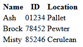

- `<table>` tags signifies this is a table. 
  - `<tr>` tag starts are row
    - `<th>` for each header cell, 
    - `<td>` for each data cell.
- Be sure to close in the opposite order that you open!

### Forms

Finally,  we will occasionally want to collect information from the user. This is handled through the form elements.

Here's an example form:

Form Example: Mail Me!

```html
<h1>Email Me!</h1>
<form action="mailto:adamtilson@gmail.com" method="post" enctype="text/plain">
    <label for="name">Your name</label>
    <input type="text" name="name" id="name">
    <br>
    <label for="email">Your email</label>
    <input type="email" name="email" id="email">
    <br>
    <label for="message">Your message</label>
    <br>
    <textarea type="text" name="message" id="message"></textarea>
    <br>
    <input type="submit" value="submit">
</form>
```

What does this look like? 

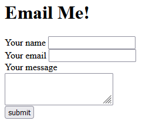

These tags work slightly different than the ones we've seen so far. Things to note:
- The entire object is wrapped in the `<form>` tag.
- `<label>` tag explains the purpose of a form element, and specifically states which one through the `for` attribute.
- Many types of input objects share the `<input>` tag
  - The specific type of object is varied through the use of the `type` attribute
    - `<input type="text">` 	Single-line text input field
    - `<input type="radio">` 	Radio button (select one of many choices)
    - `<input type="checkbox">` 	Checkbox (select zero or more of many choices)
    - `<input type="submit">` 	Submit button (submits the form)
    - `<input type="button">`   Generic button. Can be attached to a JavaScript function.
  - `id` and `name` attributes uniquely identify the form object.
  - `value` provides a default value for the object
  - the form `action` attribute shows the destination of the form
  - the form `method` attribute shows how the form will be submitted, e.g. through GET or POST
  - some tag types even give simple validation, e.g. `<input type="email">`

[The W3Schools Form Tutorial](https://www.w3schools.com/html/html_forms.asp) is very good.

## Lab Assignment

For the lab project, we are going to be making a multi-user to-do list application. The final version of it will look similar to this:

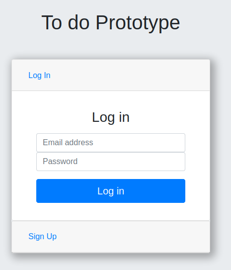

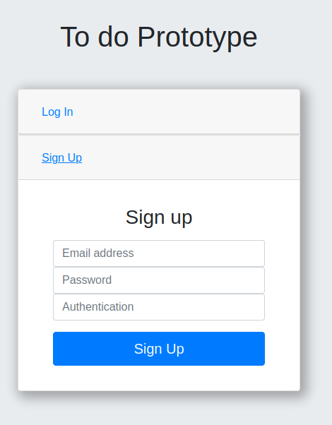

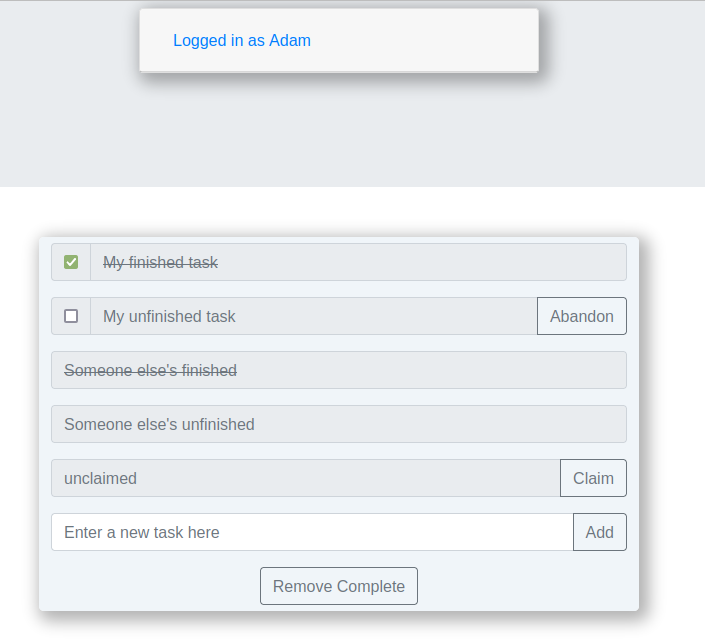

However, if you take away the styling, it looks much more humble:

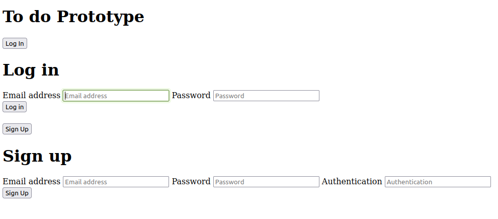

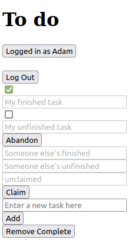

For this lab you are to implement the HTML for these two states.

Recommended approach
- Look at the pictures and identify potential HTML elements
- Is there one form? Multiple forms?
- It does not need to be perfect at this stage, because as you learn more with CSS next week, you may need to make some further adjustments to the HTML

## References

[W3Schools HTML](https://www.w3schools.com/html/default.asp)

[W3Schools Forms](https://www.w3schools.com/html/html_forms.asp)

A. Yu. The Complete Web Development Bootcamp. [Udemy.com](https://www.udemy.com/course/the-complete-web-development-bootcamp/)

### Useful Exercises
- `Reference Document`
  - A live HTML document which serves as a massive reference sheet that includes an example of all the things you've learned to date
  - You can refer back to this later on!
  - I did this in all of my courses in University, trying to take a one-page reference sheet away from each one